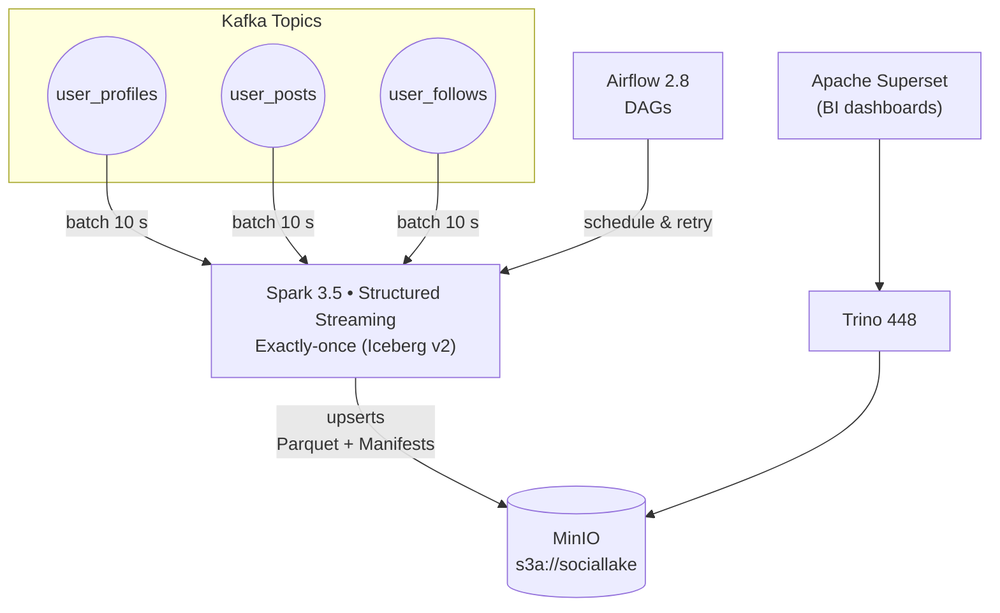

# data_Analylitics_pipeline
A fully-orchestrated Spark + Airflow pipeline that ingests open municipal data every night, builds a star-schema warehouse, and surfaces ‘What-if’ mobility &amp; weather insights through SQL and lightweight ML.

  %% ===========  Styles (no commas!) ===========
  classDef spark fill:#FECACA stroke:#B91C1C color:#111
  classDef graph fill:#C7D2FE stroke:#4338CA color:#111
  classDef airflow fill:#FDE68A stroke:#D97706 color:#111
  classDef trino fill:#A5F3FC stroke:#0891B2 color:#111
  classDef viz fill:#D8B4FE stroke:#7C3AED color:#111
  classDef api fill:#BFDBFE stroke:#2563EB color:#111

  class SparkSS spark
  class Janus graph
  class Airflow airflow
  class Trino trino
  class ClickHouse trino
  class Superset viz
  class API api
  class MinIO trino
